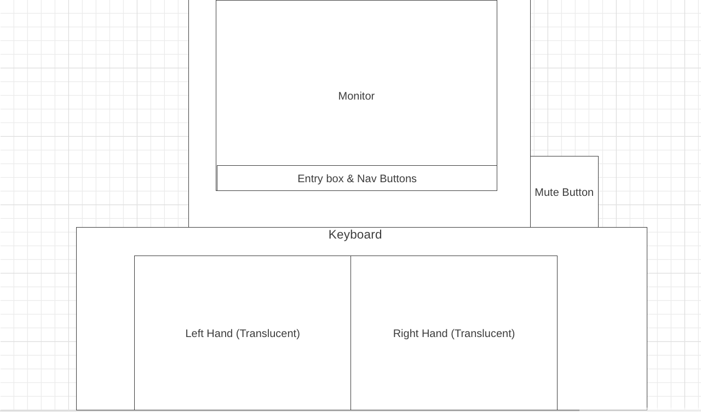

# slip-of-the-hand


[Slip of the Hand](https://cracine79.github.io/slip-of-the-hand/) is an interactive demo that explains and generates a specific type of typo - a Slip of the Hand (SlotH)


A Slip of the Hand occurs when one attempts to type a word or phrase into a keyboard, but with one or both hands mispositioned, accidentally resulting in a different, but real word or phrase. For example, if you were trying to type the word   ***DRY*** into the keyboard, but your hands happened to be mistakenly mispositioned one key to the left, this would result in you typing the word ***SET***.  

### Wireframe


* Keyboard and hands that mimic user input with animation and lighted keys/fingers.
* Entry box and nav buttons available on all pages to enter a word and generate potential SlotHs
* Mute button to silence typing sounds
* Additional nav buttons on monitor in certain screens

## Functionality and MVPs:

### When using Slip of the Hand, users can:

* Enter a word and have the program return all possible SlotHs that might have resulted from 80 possible combined hand-slips.  If the word has a unique typing pattern and no SlotH exists, this will be returned as well. When returning the words, the hand/keyboard animation demonstrates how the same typing pattern can reproduce the various words.


* The generation of SlotHs is a relatively simple problem which requires the keyboard to be broken down into a 4x14 array.  Each word is translated into a typing pattern.  Because of the assumption that hands can slip in independent directions, the word needs to then be broken into left and right hand indivdual patterns, but maintaining the order of letters between both hands.  The program then generates 8 slip patterns for each hand, one for each direction (up, down, left, right, four diagonals).  The right and left pattern are then reassembled and recoded into a string.  All 80 potential strings are then sent to the API which returns those which have a positive hit.  (In original code, Left Pattern functions mirror Right Pattern Functions and are omitted here for brevity)


```javascript
Class Word {
    
    KEYBOARD  = ["1234567890-=".split(""),
                ["tab"].concat("qwertyuiop[]".split("")), 
                ["caps lock"].concat("asdfghjkl;'".split("")), 
                ["shift"].concat("zxcvbnm,./".split("")).concat(["shift"]),
                ["","",""," ", " ", " ", " ", " ", " ", "", "", ""]
                ]

    DIRS = [[-1, 1], [0, 1], [1, 1],
            [-1, 0], [0,0], [-1, 0],
            [-1, -1], [0, -1], [1, -1]];
           
    
    constructor(value){
        this.value = value.toLowerCase();
        this.positionArr = this.toFullPattern();
    }

    toFullPattern() {
        const positionArr = [];
        let arr = [];
        arr = this.value.split("");
        for (let i=0; i< arr.length; i++){
         
            for (let j=0; j<4; j++){
      
                for(let k = 0; k<(this.KEYBOARD[j].length); k++){
                   
                    if(arr[i] === this.KEYBOARD[j][k]){
                        positionArr.push([j,k])
                    }
                }
            }
        }
        return positionArr;
    }

    toRightPattern(){
        const rightPattern = [];
        for(let i = 0; i<this.positionArr.length; i++){
            if (this.positionArr[i][1]>5){
                rightPattern[i] = this.positionArr[i]
            } else {
                rightPattern[i] = undefined;
            }
        }
        return rightPattern;
    }

    allRightPatterns = () => {
        const rightPattern = this.toRightPattern();
        const allTheRightPatterns = [];
        this.DIRS.forEach((dir) => {
            let subArr = [];
            for(let i = 0; i< rightPattern.length; i++){
                if (rightPattern[i] === undefined){
                    subArr[i] = undefined;
                } else {
                    subArr[i] = ([rightPattern[i][0]+dir[0], rightPattern[i][1]+dir[1]]);
                }
            }
            allTheRightPatterns.push(subArr)
        })
        return allTheRightPatterns;
    }

    allPatternsCompiled(){
        const alp = this.allLeftPatterns();
        const arp = this.allRightPatterns();
        const allPatternsBothHands = [];
        for(let i = 0; i<alp.length; i++){
            for(let j = 0; j<alp.length; j++){
                let innerArray = [];
                for (let k = 0; k<alp[0].length; k++){
                    if(alp[i][k]!==undefined){
                        innerArray.push(alp[i][k]);
                    } else {
                        innerArray.push(arp[j][k]);
                    }
                }
                allPatternsBothHands.push(innerArray);
            }
        }
        return allPatternsBothHands;
    }
  
    static patternToWord(pattern){
        const arr = [];
        const alphabet="abcdefghijklmnopqrstuvwxyz 1234567890-=`,./;'[]".split("");
        let caps = false; 
        pattern.forEach((pos)=>{
            const char = KEYBOARD[pos[0]][pos[1]];
            if (alphabet.includes(char)){
                arr.push(char)
            };
        })
        return arr.join("")
    }

    allPossibleSloths(){
        const allPatsCompiled = this.allPatternsCompiled();
        const allWordsCompiled = [];
        allPatsCompiled.forEach((pat)=>{
            if (Word.patternToWord(pat) !== this.value && !allWordsCompiled.includes(Word.patternToWord(pat))){
            allWordsCompiled.push(Word.patternToWord(pat))
            }
        })
        return allWordsCompiled;
    }
}
```
* A more complex problem upon generating the returned SlotH array was getting the hands to type the incorrect word, but with the correct finger positions.  Because of the need for the typing pattern to reflect the original pattern of the SlotH generating word, hands need to be animated independently of the keyboard, and of each other.  

```js
async handsTypeWords(sentence, typedOn, wait = 30, orig, color, classname){
        orig ||= sentence;
        const left = "qwertgfdsazxcvb".split("");
        const right = "yuiophjklnm".split("")
        const origLetters = new Word(orig);
        const letters = new Word(sentence);
        const origLettersArr = orig.split("");
        const lettersArr = sentence.split("");
        const origPattern = origLetters.toFullPattern();
        const newPattern = letters.toFullPattern();
 
        color ||= "red";

        let leftShift = undefined;
        let rightShift  = undefined;

        for(let i=0; i<origPattern.length; i++){
            
            if (left.includes(origLettersArr[i].toLowerCase()) && leftShift === undefined){
                let leftVertShift = (newPattern[i][0]-origPattern[i][0])
                let leftHorizShift = (newPattern[i][1]-origPattern[i][1])
                leftShift = [leftVertShift, leftHorizShift]
            } else if (rightShift === undefined){
                let rightVertShift = (newPattern[i][0]-origPattern[i][0])
                let rightHorizShift = (newPattern[i][1]-origPattern[i][1])
                rightShift = [rightVertShift, rightHorizShift]
            }
        }

        leftShift ||= [0,0]
        rightShift ||= [0,0]

        let i = 0;
        const keyboard = document.getElementById("keyboard");
        const leftHand = document.getElementsByClassName("leftHand")[0];
        const rightHand = document.getElementsByClassName("rightHand")[0];
        
        leftHand.style.paddingLeft = `${70+(leftShift[1]*45)}px`
        
        leftHand.style.paddingTop = `${100+(leftShift[0]*45)}px`
        rightHand.style.paddingLeft = `${360+(rightShift[1]*45)}px`
        rightHand.style.paddingTop = `${100+(rightShift[0]*45)}px`

        while (i<lettersArr.length){
        
            typedOn.append(lettersArr[i]);
            if (lettersArr[i] === " "){
                keyboard.className = "space_pressed"
                rightHand.id = "rh_space_pressed"

            } else {
                keyboard.className = `${lettersArr[i].toLowerCase()}_pressed`
            }

            
            if (left.includes(origLettersArr[i].toLowerCase())){
                leftHand.id = `lh_${origLettersArr[i].toLowerCase()}_pressed`
                rightHand.id = "rh_unpressed"
            } else if (right.includes(origLettersArr[i].toLowerCase())){
                rightHand.id = `rh_${origLettersArr[i].toLowerCase()}_pressed`
  
                leftHand.id = "lh_unpressed"
            }

            classname ||= "keyTopper"
         
            this.playClick()
          
            let key = document.createElement('div');
            key.id = `${lettersArr[i].toLowerCase()}_topper`
            key.className = classname;
            key.style.backgroundColor = `${color}`
            let keyHand = document.getElementById('hands_keys');
            keyHand.append(key);
            await this.waitForMs(wait); 
            i++
        }
        keyboard.className = "unpressed";
        leftHand.id = `lh_unpressed`;
        rightHand.id = `rh_unpressed`;
        rightHand.style.paddingLeft = "360px"
        rightHand.style.paddingTop = "100px"
        leftHand.style.paddingLeft = "70px"
        leftHand.style.paddingTop = "100px"
    }
  ```


* To make the program more interesting, SlotH queries an API that includes abreviations and slang in its dictionary.  As such some of the words returned may be unfamiliar.  Users can click on each returned word for a general definition.


* Finally, thorough instructions and demonstrations of Slip of the Hand assumptions and generations can be found in the "More Sloth Info" Section."  These include links to additional animations and demonstrations. 


## Technologies, Libraries, APIs:

### This project is implemented iwth the folowing technologies:

* Free Dictionary API: https://dictionaryapi.dev/.
* Webpack to bundle and transpile the source JavaScipt code.
* npm to manage project dependencies

## Creatiive Content Acknowledgements

### This project uses the following creative content:

* Def Leppard sticker available at: https://www.hiclipart.com/free-transparent-background-png-clipart-xpyqa
* Stussy sticker available at: https://www.pngfind.com/mpng/hhbRRhi_stussy-8-ball-png-png-download-stussy-brand/#google_vignette
* No Fear sticker available at: https://www.hiclipart.com/free-transparent-background-png-clipart-hbqyw
* Keyboard clicking sound available at: https://pixabay.com/sound-effects/keyboard-typing-5997/
* Keyboard click sound available at:  https://pixabay.com/sound-effects/keyboard-spacebar-hit-101812/

All other images are produced by the developer using Adobe Photoshop and Adobe Illustrator

## Implementation Timeline

<ul>
  <li>Thursday:   Setup project.  Figure out how translate a word into key strokes for left and right hands, and devise algorithm to search for all possible Slips of the Hand.  Write scripts to perform tasks & make work with simple dictionary.</li>
  <li>Friday:  Setup interface to accept word/phrase from user, query API & return array of slips of the hand </li>
  <li>Saturday: Introduction Window, Explanation & Animation Slip of the Hand Example</li>
  <li>Sunday:  Organizing results into separate displays according to category.  Formatting & styling of page & background.  
  <li>Monday:  Create function to cycle through automated animations of resulting slips of the hand</li>
  <li>Tuesday: Work on function where animated hands on screen type at same time as user presses keys</li>
  <li>Wednesday: Bonus Feature? Definitions?  Additional styling & formatting?  Bug fix?</li>
</ul>


## Future Implementation
Currently the app only works for single words.  It would be an interesting exercise to expand functionality so that the user could enter a phrase and receive SlotH phrases back.  

Currently the program does have the ability assume that a shift would result in a non-output key being striked, like [shift] or [CAPS LOCK].  While it accurately returns these words, in the future it would be nice if the hands typed the shortened words with the accurate pattern as well. Currently the image gets glitchy when a shortened SlotH is returned,  

There may also be a possibility for a game, where the computer gives the user a typed word, and asks the user to find the SlotH associated with the word by shifting one or both hands and retyping. 


